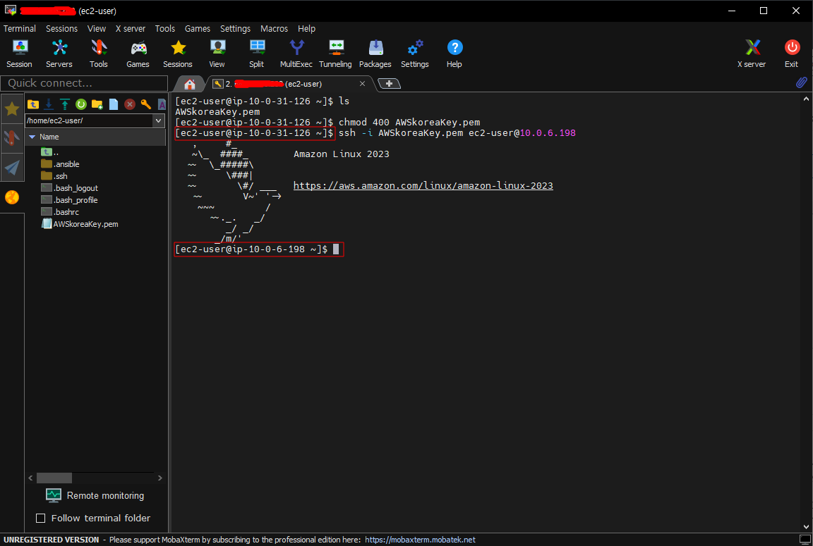
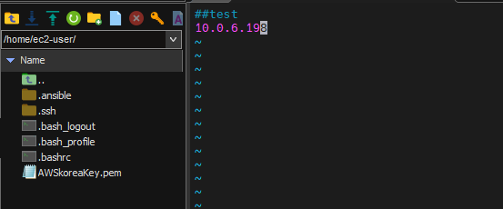
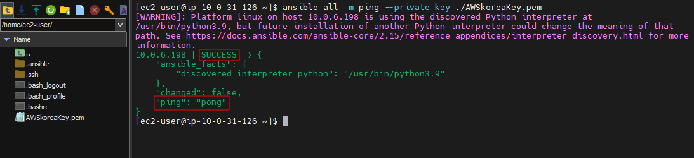

# myAnsible
 
Ansible 사용법을 익히고 서버 관리 및 자동화를 학습하기 위한 레포지토리

**✔ 본 테스트는 Amazon Linux 2023에서 실행되었음을 알립니다.**

## 1. Ansible 설치

#### 설치 진행
``` bash
sudo dnf -y install epel-release
sudo dnf install -y ansible
ansible --version
```
> **CentOS 8이라면 epel을 repo에 설치하는 과정이 필요하지만 Amazon Linux 2023은 필요가 없다.** 혹시 몰라서 epel-release를 설치하는 과정을 추가한다.

#### SSH 키 삽입 및 Handling

Ansible은 SSH 기반 통신이 이루어지기 때문에 SSH 키를 생성해서 진행하는 것이 좋다. 

✔ user-password로 통신하는 것도 가능하나 좋은 방법은 아니고, AWS의 EC2로 진행할 것이기 때문에 SSH로 진행한다.

#### 일반적인 CentOS 진행과정
``` bash
ssh-keygen
ssh-copy-id [원격서버계정ID]@[원격서버IP]
ssh [원격서버계정ID]@[원격서버IP]
```
#### AWS Linux 2023 진행과정
``` bash
# EC2 인스턴스로 .pem 복사
chmod 400 [yourkeyfile].pem
ssh -i [yourkeyfile].pem ec2-user@[원격서버IP]
```

> AWS이기 때문에 key 생성 및 copy과정은 제외하고 인스턴스에 pem키만 넣어주고 테스트한다.



## 2. Inventory 파일 작성

#### file 작성
``` bash
sudo vi /etc/ansible/hosts
```


#### 테스트
``` bash
ansible all -m ping --private-key [ssh key 파일].pem
```


이러한 모습이 보이면 환경구축이 끝난 것을 알 수 있다.

[출처] https://5equal0.tistory.com/entry/Ansible-%EC%95%A4%EC%84%9C%EB%B8%94Ansible-%EA%B0%9C%EB%85%90%EA%B3%BC-%EC%84%A4%EC%B9%98%EC%82%AC%EC%9A%A9%EB%B2%95-w-CentOS-76